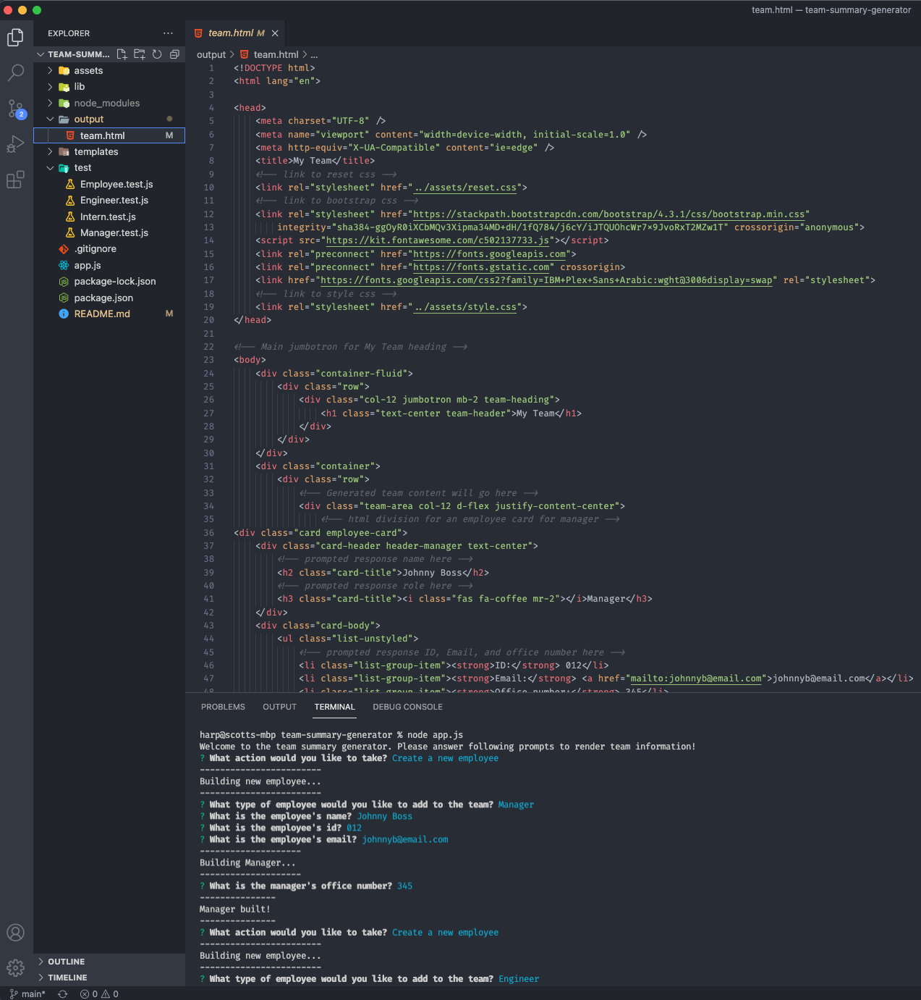
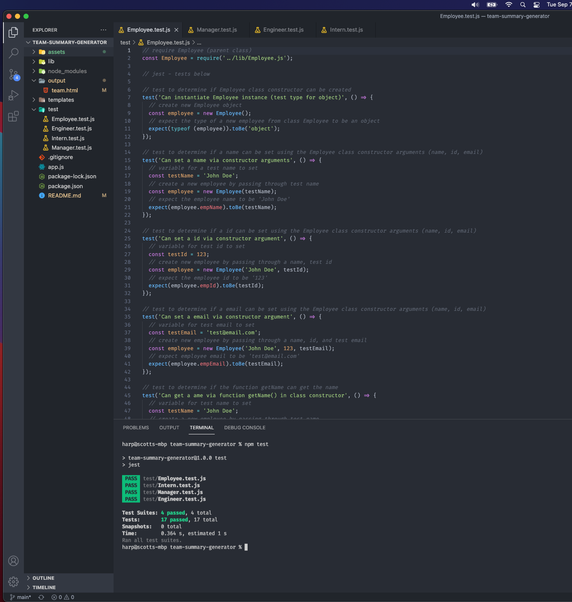
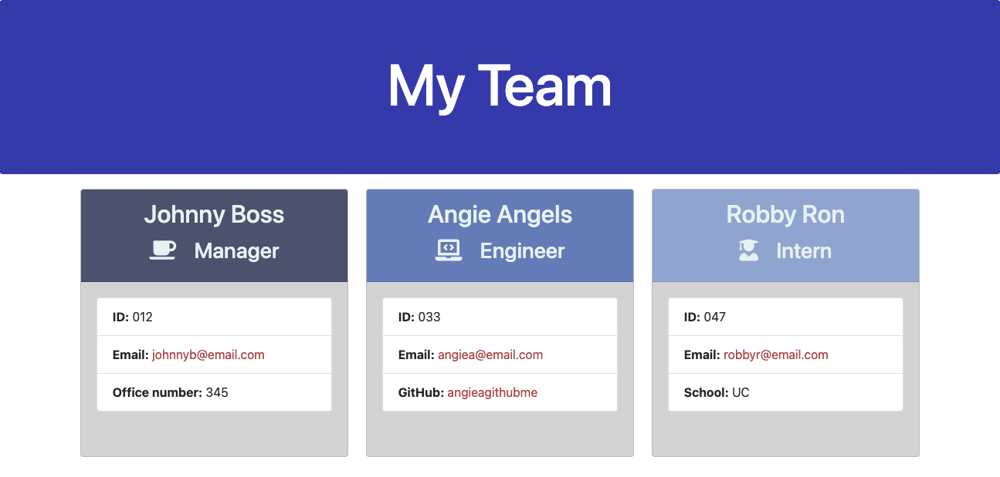

# Team Summary Generator
Node.js command line application to take in team info and generate HTML to display
Object Oriented Programming and Test-Driven Development

 
 
 
 
 
 

### Walkthrough Video: https://drive.google.com/file/d/19B7B7x2fmtiYoRcrh0s5lHC8LOmfJ933/view?usp=sharing

### Github: https://github.com/ssharp0/team-summary-generator

## Table of Contents

- [Description](#description)
- [User Story](#user-story)
- [Usage](#usage)
- [Installation](#installation)
- [Testing](#testing)
- [Screenshots](#screenshots)

## Description
This is a node.js command line application that prompts a user for information about software engineering employees to build and generate a HTML webpage that displays summaries for each individual.

This is a video gif showing the application (jest testing and node.js application use to generate employee card summaries)

## User Story

This application will generate a webpage that displays a team's basic information with quick access to their:

- Role
- Name
- ID
- Email
- Manager's office number
- Engineer's github username
- Intern's school

## Usage

When `node app.js` is run in the root project terminal, then the user is prompted with a series of questions for employee information to generate a team summary with details of each individual. Node.js must be installed prior.

The user is asked if they would like to create an employee and what type of role to create (manager, engineer, intern)

The user will then be prompted to provide a name, ID, email and either a office number, github username, or school (dependent on the role).

After the user is finished, a team.html will be generated in the output folder. This will display the response information for each individual.

Note, testing was done with jest.

## Installation

`npm init -y`

`npm i inquirer`

`npm install --save-dev jest`

## Testing

`npm install --save-dev jest`

`npm test`

Testing is done with jest. Four constructor classes: Employee (parent/main), Manager, Engineer, Intern

## Screenshots

Node Demo:

Tests Demo (jest):

Output HTML Demo Example (in output folder):

